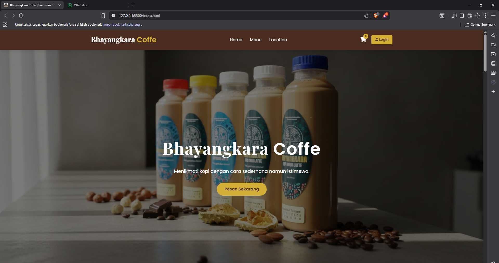

# ☕ Bhayangkara Coffee

Bhayangkara Coffee adalah website coffee shop berbasis web yang menampilkan berbagai menu minuman kopi dan non-kopi dengan tampilan modern dan user-friendly.  
Project ini dibuat sebagai latihan pengembangan frontend menggunakan teknologi web dasar.

---

## ✨ Fitur
- 🧾 Tampilan katalog menu minuman
- 🛒 Fitur Add to Cart
- 💰 Menampilkan harga produk
- 🎨 UI modern dan responsif
- 🔐 Tombol Login (UI only)

---

## 🛠️ Teknologi yang Digunakan
- HTML5  
- CSS3  
- JavaScript (Vanilla JS)

---

## 📸 Tampilan Aplikasi


---

## 🚀 Cara Menjalankan Project
1. Clone repository ini
   ```bash
   git clone https://github.com/satriaimaniar/bhayangkara-coffee.git
